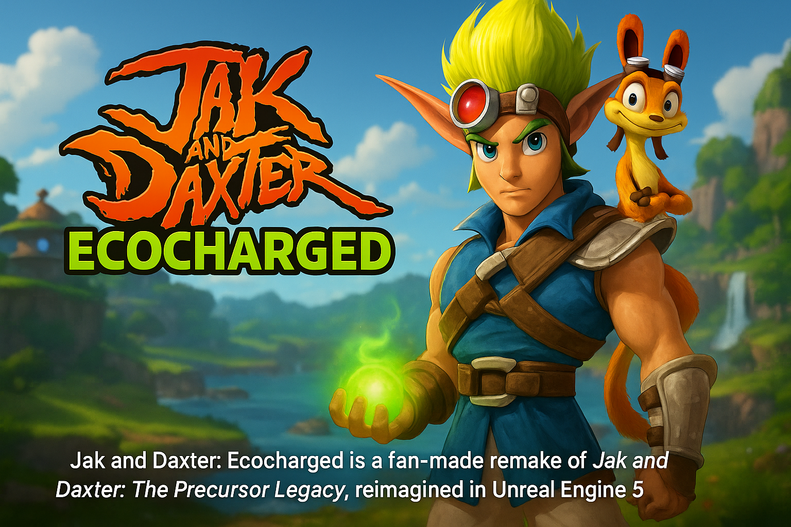

# 🌟 Jak and Daxter: Ecocharged

**Jak and Daxter: Ecocharged** is a fan-made remake of *Jak and Daxter: The Precursor Legacy*, reimagined in **Unreal Engine 5**. This project is a love letter to the classic PS2 platformer, built to revive its vibrant world, thrilling gameplay, and eco-powered magic in a modern, high-fidelity engine.

 <!-- Replace with your own image link -->

---

## 🎮 Features

- 🔹 **Faithful recreation** of levels, characters, and gameplay mechanics  
- 🔹 **Modern visuals** powered by Unreal Engine 5 (Nanite, Lumen, etc.)  
- 🔹 **Smooth platforming**, eco powers, and dynamic animations  
- 🔹 **Fully explorable hubs** and seamless level transitions  

---

## 🚀 Getting Started

> _Note: The project is currently under active development._

### Prerequisites

- [Unreal Engine 5](https://www.unrealengine.com/en-US/unreal-engine-5)
- A capable PC (Nanite + Lumen are performance-intensive!)
- Git LFS (if using large binary assets)

### Clone the Repository

```bash
git clone https://github.com/yourusername/jak-and-daxter-ecocharged.git
cd jak-and-daxter-ecocharged
```

### Open in Unreal Engine

1. Open the `.uproject` file in UE5.
2. Let the engine compile shaders and build the project.
3. Press `Play` to explore the world of Jak and Daxter in UE5!

---

## 📸 Screenshots

_Coming soon_
<!-- Add screenshots or gifs of gameplay here -->
<!-- <p align="center">
  
  
</p>-->

---

## 📅 Roadmap

- [x] Basic movement & platforming
- [ ] Eco orb collection
- [ ] Prototype hub world
- [ ] Enemy AI
- [ ] Voice & sound integration
- [ ] Cutscene system
- [ ] Full level remakes

---

## 🤝 Contributing

Pull requests are welcome! If you'd like to help out with level design, scripting, or 3D modeling, feel free to fork the repo and submit a PR. Please make sure any content you contribute is original or properly licensed.

---

## 📜 Disclaimer

This is a **fan-made project** and is not affiliated with or endorsed by **Naughty Dog** or **Sony Interactive Entertainment**. All rights to Jak and Daxter belong to their respective owners.  
This remake is intended for **educational and nostalgic purposes only**. No commercial use is intended or permitted.

---

## ❤️ Credits

- Original game by **Naughty Dog**
- UE5 Remake by **James Mills**
- Special thanks to the **Jak and Daxter community** for keeping the legacy alive!

---

## 🌐 Stay Connected

- 📺 Dev logs: [YouTube](https://www.youtube.com/@JamesMillsDeveloper) 
- 🗨️ Join the community: [Discord](https://discord.gg/M8ESJdDJmY)
- 🛠️ Follow updates on [GitHub](https://github.com/yourusername/jak-and-daxter-ecocharged)

---
